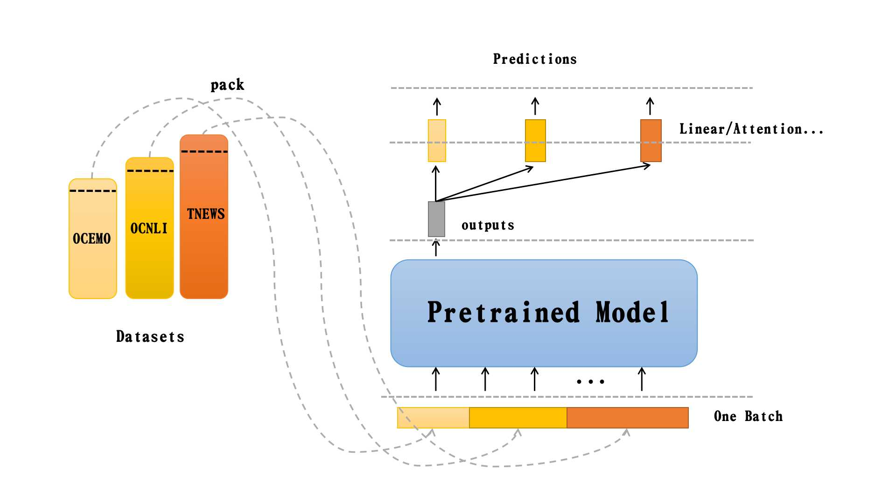

## [NLP中文预训练模型泛化能力挑战赛](https://tianchi.aliyun.com/competition/entrance/531841/introduction)
(since 2020/11/20)

### Requirements

- pytorch > 1.0.0
- transformers
- sklearn
- numpy
- tqdm
- pandas

### Model Archietcture

### Run the following command to train:

`python3 multitask_finetune.py`  or

`nohup python3 -u multitask_finetune.py > output.log 2>&1 &`

###  Models

- Bert+Linear

- roberta-large+Linear

- roberta-base+Linear

- chinese-roberta-wwm-ext+Linear

### Experiment Results

| Model | Batch Size | Learning Rate | Epochs | Valid F1 | Test F1 | Date | Statistics |
| :----:| :----: | :----: | :----: | :----: | :----: |  :----: |  :----: |
| BertBaseLinear | 64 | 5e-5 | 7 | 0.5708366690203711 | 0.5834| 2020/12/26 09:30|Stats_BertBaseLinear_BATCH64_Epoch10_LR5e-05.csv |
| BertBaseLinear | 64 | 5e-5 | 10 | 0.5669902108325462 | 0.5788| 2020/12/26 11:15 |Stats_BertBaseLinear_BATCH64_Epoch10_LR5e-05.csv |
| ChineseRoberteLinear | 64 | 5e-5 | 4 | 0.609208530047737 | 0.6041| 2020/12/27 8:30 |Stats_ChineseRobertaLinear_BATCH64_Epoch5_LR5e-05.csv |

### References
- [关于中文预训练模型泛化能力挑战赛的调研](https://tianchi.aliyun.com/forum/postDetail?spm=5176.12586969.1002.12.25a02494RQLgEY&postId=145917)
